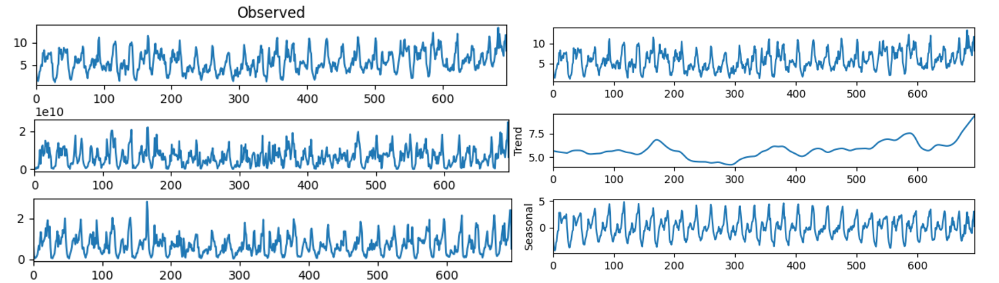
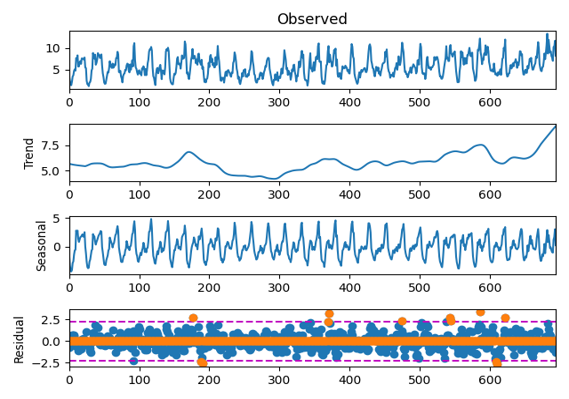
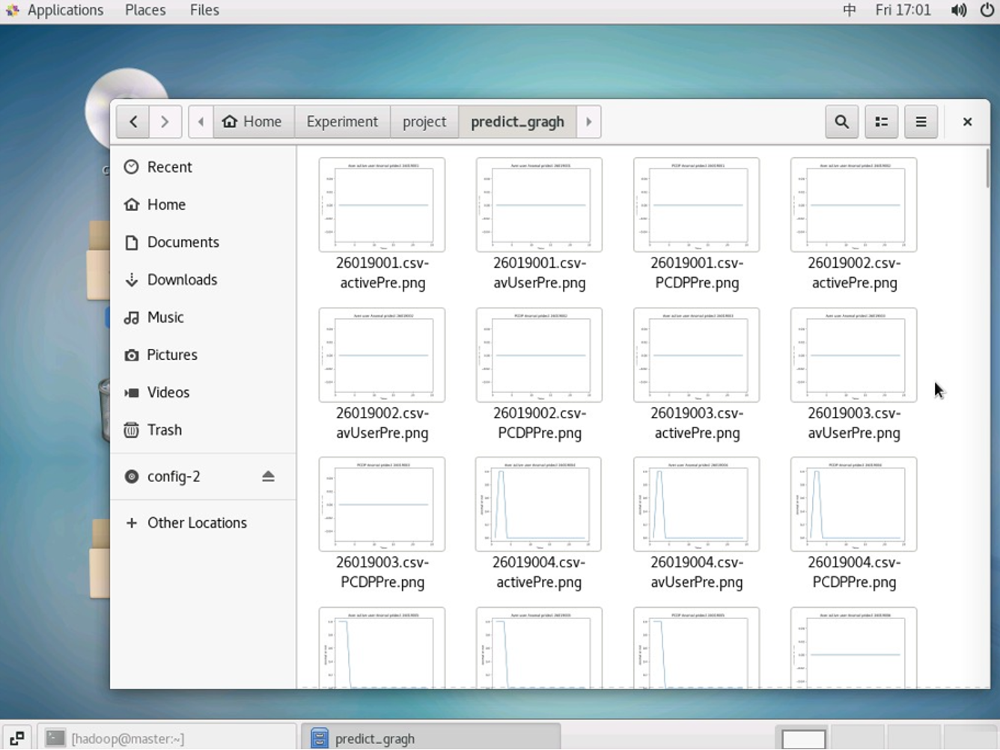
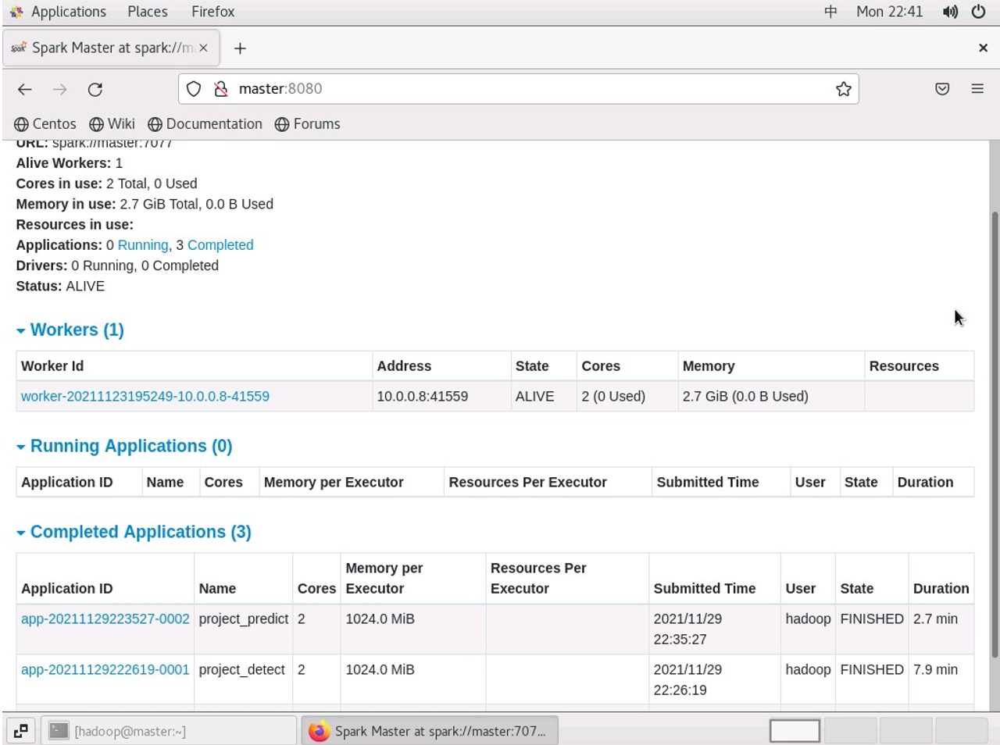

Contributor: ZYZ, MXY, LJJ

Dataset source: Desensitization data released by Chinese telecom and Huawei in the National Big Data Challenge Competition

### Summary:

- Analysed tens of thousands of data about 67 KPI performance indicators of operator base stations within 29 days, focusing on the application scenarios of intelligent operation and maintenance;
- Realised the early warning mechanism of abnormality and helped engineers to prevent problems in advance by conducting anomalies detection, abnormality prediction and trend prediction for three core indicators of different cells;
- Used multiple cloud server resources within the group to build a cluster, so as to realize the parallelization of computing.

### Workflow:

1. Time Series Decomposition
    A STL time series decomposition is performed on the series of three core metrics: average number of users, PDCP traffic, and average number of activated users in a given cell. This enables the decomposition of the trend part, the period part, and the residual part of the time series.
    
    
2. Anomalies Detection based on boxplot criterion
    The residuals are used as the criterion in the test of anomalous values for the core indicators for each cell. In order to minimize the effect of anomalies values, the boxplot criterion is used here for anomalies detection of data.
    
    
3. Prediction
    A dataset of anomalies is formed by recording the anomalies of the corresponding metrics after detecting the anomalies according to the aforementioned way. We use all 67 KPI indicators of the day before a certain point in time as input vectors, and adopt the idea of binary classification to output the output value of a certain indicator at a certain point in time in each neighborhood in the form of 0/1, with 0 indicating that no anomalies occurs at a certain point in time and 1 indicating that an anomalies is predicted to occur at a certain point in time.

    The logarithmic odds regression model is selected, the leave-out method is used, and the logarithmic odds regression model is used to maximize the "log likelihood" for the training set, and the gradient descent method is used to maximize the likelihood function to find the optimal solution can be realized for training.
     
    
4. Deployment
    Used multiple cloud server resources within the group to build a cluster, so as to realize the parallelization of computing.
    
    
5. Evaluation

    The 67 KPIs corresponding to the moments of the previous day of a given day of historical data are taken as inputs to predict the anomalies of the following day (the last data is the prediction of an unknown day), while the correctness rate is recorded. The F1 value, i.e., based on the reconciled average of the check accuracy rate and the check completeness rate, is used to test and evaluate our prediction level.

    |   No.    | Average #Users |   PDCP   | Average #Activation Users |
    | :------: | :------------: | :------: | :-----------------------: |
    | 26019001 |    0.909091    | 0.909091 |         0.909091          |
    | 26019002 |    0.956522    | 0.956522 |         0.956522          |
    | 26019003 |    0.857143    | 0.857143 |         0.857143          |
    | 26019004 |    0.909091    | 0.909091 |         0.909091          |
    | 26019005 |    0.909091    | 0.909091 |         0.909091          |
    | 26019006 |    0.909091    | 0.857143 |         0.909091          |
    | 26019007 |    0.956522    | 0.956522 |         0.956522          |
    | 26019008 |      0.9       | 0.857143 |            0.9            |
    | 26019009 |    0.857143    | 0.857143 |         0.857143          |
    | 26019010 |    0.909091    | 0.909091 |         0.909091          |
    | ... |    ....    | ... |         ...          |
