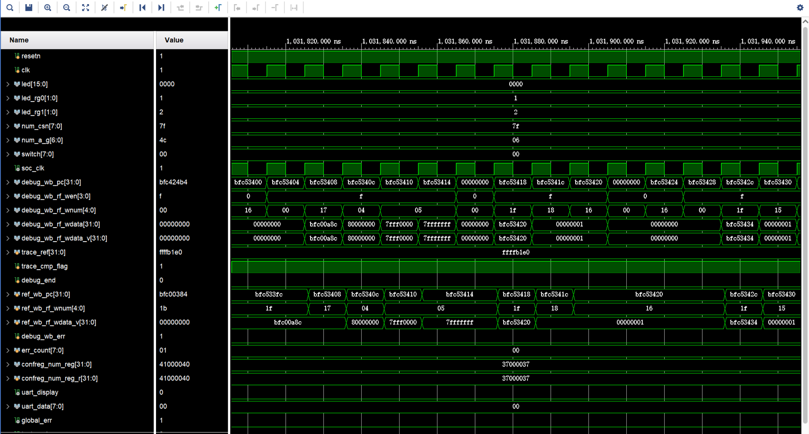
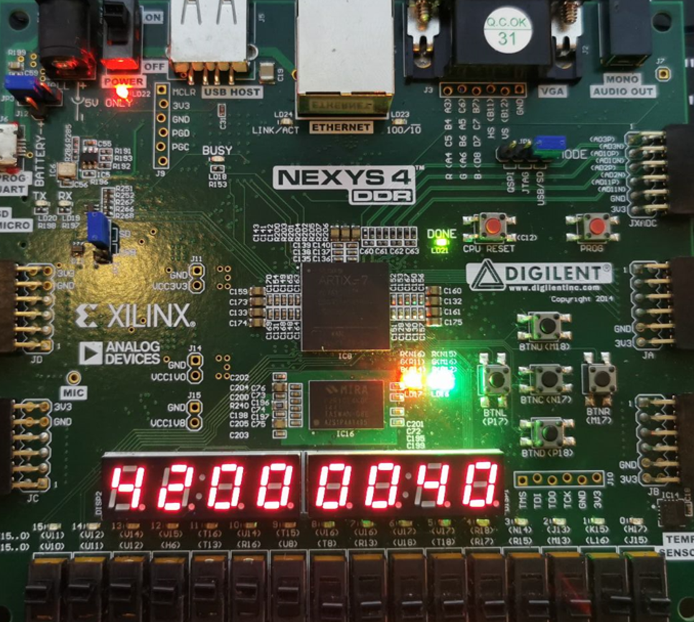

Contributor: HYH, ZYZ, ZYF

Instruction documents: https://github.com/cyyself/CO-lab-material-CQU

### Summary:
We took our Principles of Computer Organization and Architecture course experiment, Simple Five-Stage Pipelined MIPS CPU, as a starting point, and expanded on it, expanding from 10 instructions to 52 ordinary instructions plus 5 privileged instructions, with the ordinary instructions consisting of 8 logical arithmetic instructions, 6 shift arithmetic instructions, 4 data move instructions and the HILO registers, 14 arithmetic instructions, 12 branching instructions, and 8 memory access instructions. We completed the extension of the instructions and correctly implemented the pipelining and branching hazard modules. After corresponding to 6 independent tests and 64 functional test points, we also packaged the SRAM interface SOC on this basis, and finally successfully realized on-board testing (N4 development board).

### Related Pictures:
1. Waveforms in simulation;
2. Trace logging in simulation;
3. Demonstration on the board: it can successfully run up to 64 test points (64 in hexadecimal is 40H), indicating that it passes the full functionality test of 52 instructions.
 
 
 