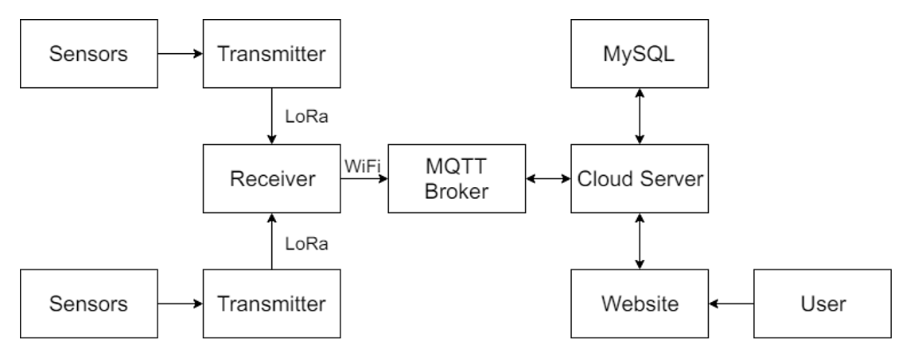
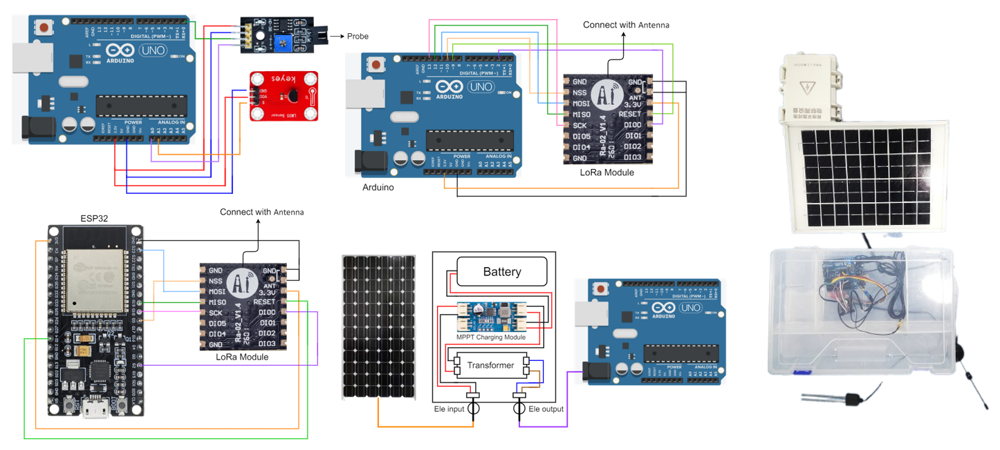
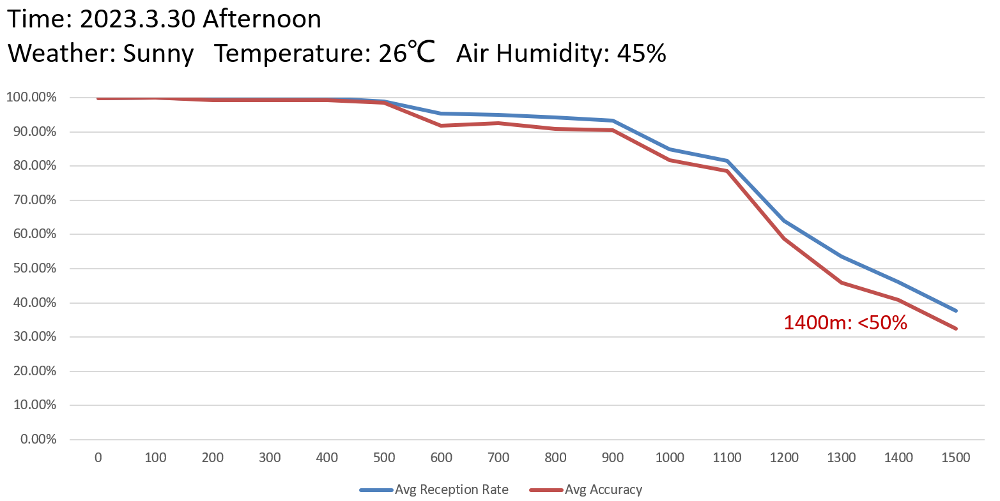
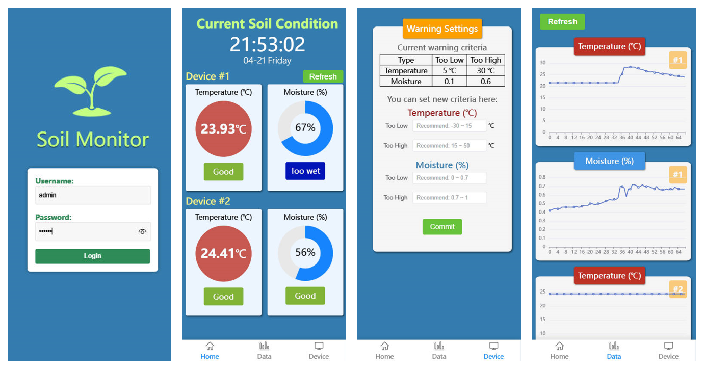

Contributor: ZYZ, WJH

With the development of information technology and its integration into agriculture, smart agriculture has become a new development trend in modern agricultural production. Monitoring soil temperature and moisture is helpful for providing data guidance for precision agriculture. We outlined the development process of a soil temperature and moisture monitoring system based on LoRa technology, including hardware selection and implementation, long-distance communication using LoRa, front-end and back-end development of the software system, cloud server deployment, and testing. The main work of this project can be summarized as follows:

1. By reviewing relevant literature, learn about the history and development of smart agriculture and its important role in modern agricultural production. Based on the application of smart agriculture, feasibility analysis and requirement analysis are conducted for the system and organized the technological roadmap for system development.

   

2. In terms of hardware, suitable components are selected, based on the principles and models of different soil temperature and moisture sensors, control boards, LoRa modules, and solar panels available on the market. Hardware control programs and filtering algorithms are developed to achieve the hardware function of the soil monitoring system. The final hardware system used an Arduino UNO R3 development board connected to an LM35 temperature sensor and a soil moisture sensor based on dielectric characteristics as the transmitting end, and an ESP32 development board supporting Wi-Fi and connected to LoRa communication modules and suction cup antennas as the receiving end. To ensure a certain degree of self-maintenance of the system in complex weather conditions, the transmitting end is connected to a solar power supply system and configured a rainproof box. To achieve remote monitoring of soil, the receiving end received data, processed it through an anomaly processing module, and uploaded it to the EMQX IoT server via Wi-Fi before storing it in the MySQL database of the cloud server deployed, making it convenient for subsequent software modules to access and interact with the data.
 
   

3. Long-distance LoRa communication testing is also conducted in Chongqing Central Park to evaluate data transmission reliability at longer distances. Communication tests are conducted every 100 meters along the central axis of the park, analyzed communication quality statistics, and determined under existing conditions, the maximum effective LoRa communication distance of the system was between 1300 and 1400 meters.

4. The development and deployment of the software system that accompanies the system are completed. The front-end of the companion software system was mainly implemented using the Vue3 framework to create a mobile-friendly user interface, with some components using the Element Plus component library, and data visualization charts based on Apache ECharts. The back-end was mainly developed using the Spring Boot framework and MyBatis-Plus to assist database interaction. The system software module includes the functions of monitoring real-time information, detecting changes in trends, and setting alerts. It has a user-friendly interface and clear data visualization and was ultimately deployed on Tencent Cloud Server, making it accessible to users through a web address.
 
   
