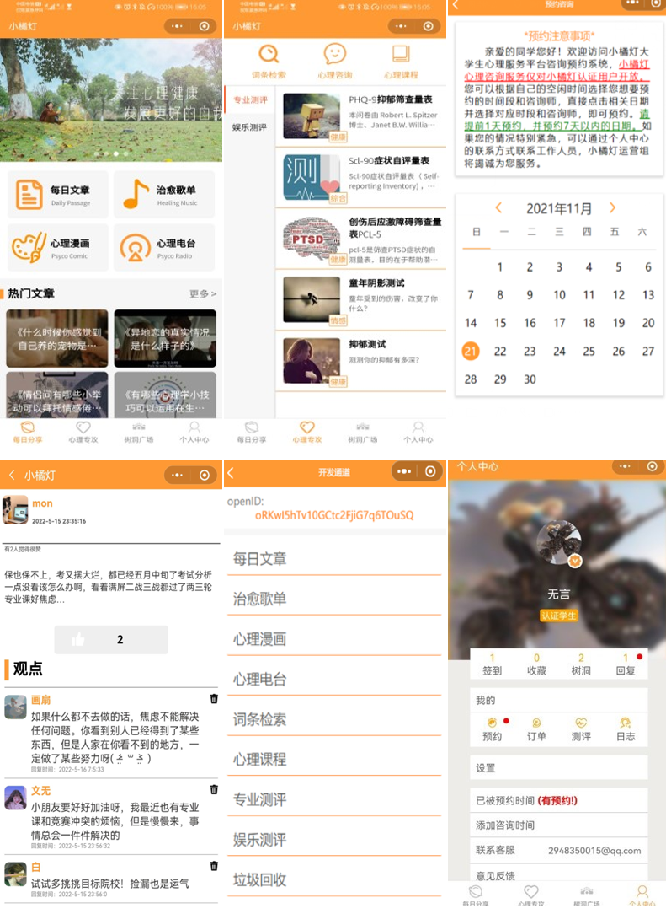

[🍊Tangerine Lamp Github Repo](https://github.com/TangerineLamp/TangerineLampCloud)

Development group: XWY, RJB, HRX, ZYZ

Tangerine Lamp is a charitable psychological service platform based on WeChat mini programme to create a spiritual community for college students through designing modules of self-assessment, consultation, emotion sharing, high-quality course sharing, pressure-releasing activities, etc..

### Acknowledgement:

* This project obtained funding from the 2021 national entrepreneurial practice project of Chongqing University (50,000 RMB);

* This project is cooperated with Chongqing Eleventh People’s Hospital and gained support from “Xinwo Cloud” psychological service platform.