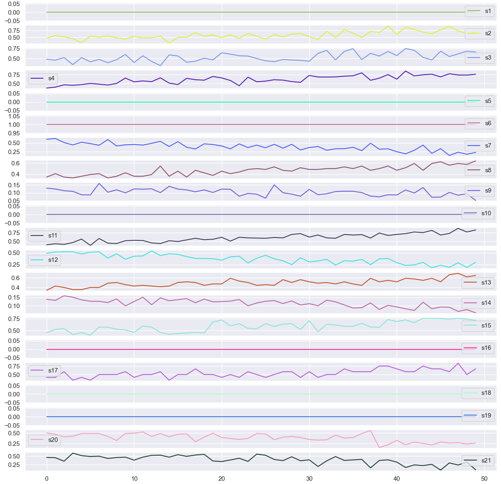
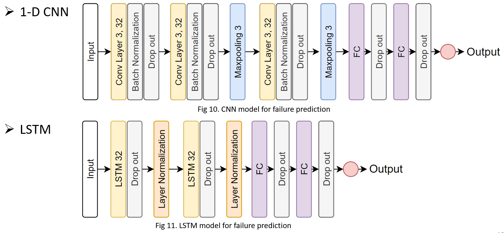
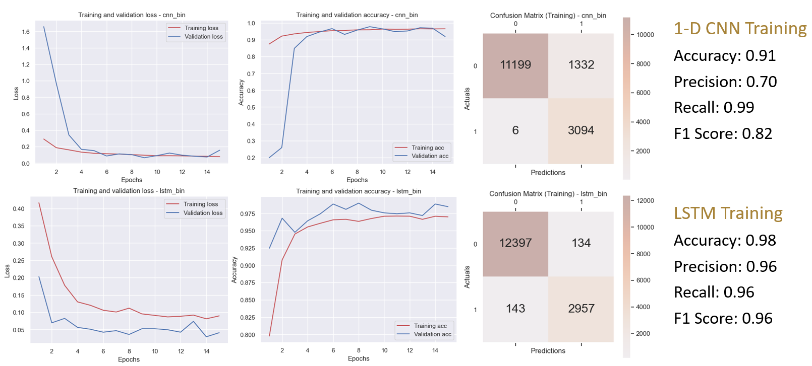
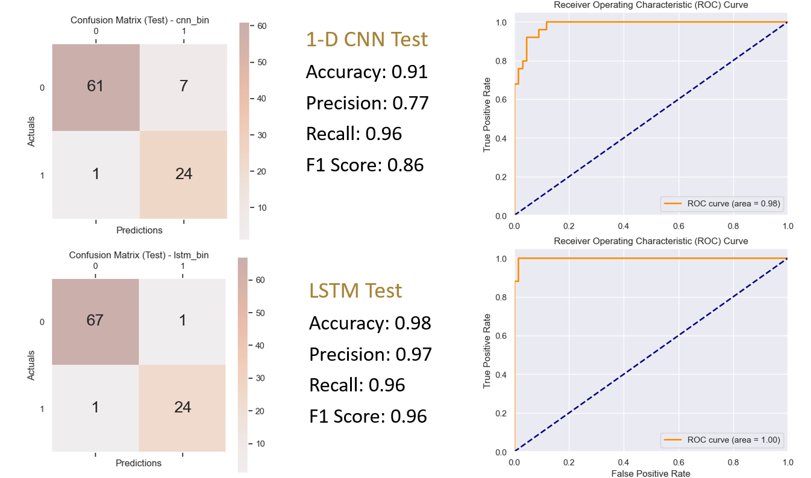
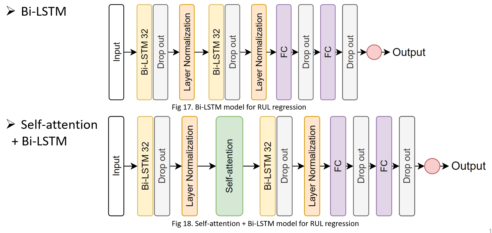
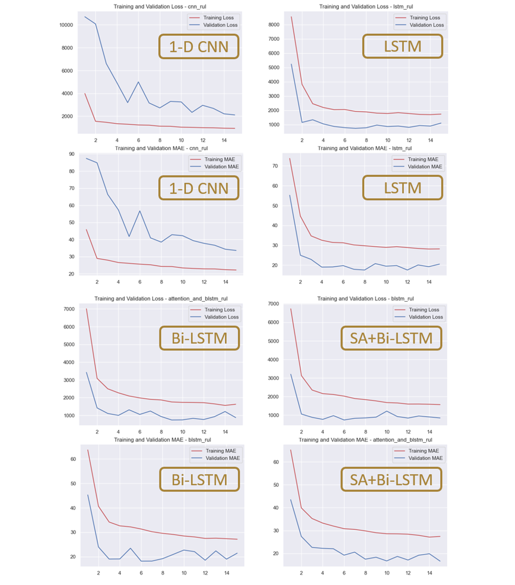

### Background and Dataset

#### 1. Predictive Maintenance
  The paradigm of predictive maintenance represents an progress from traditional reactive and scheduled maintenance approaches. Instead of only relying on fixed intervals for repairs or addressing failures as they occur, predictive maintenance is to anticipate and mitigate potential issues before they escalate. 

  Data-driven predictive maintenance, as applied to turbofan engines, involves the meticulous analysis of sensor data and historical maintenance records. This approach enables the development of models capable of discerning subtle patterns and anomalies that may serve as precursors to impending failures.

  In summary, the data-driven predictive maintenance changes the management of turbofan engines. This shift will not only help reduce the risks associated with unexpected failures but contribute to optimizing operational costs and improving reliability of turbofan engines.

#### 2. Goal
  * The prediction of failures in advance. This involves forecasting whether a failure is likely to occur within a predetermined time window, such as 30 operational cycles.

  * Estimating the remaining useful lifetime (RUL) of a specific turbofan engine. This entails a continuous monitoring process that integrates real-time sensor data with historical performance records. The model assesses wear and tear, identifies performance degradation trends to estimate of how much operational life the engine has before significant issues are likely to arise.

#### 3. Data Description
  The data set is derived from running turbofan engines. The data set is divided into a training set and a test set. The dataset contains 21 sensor readings which form the multi-variate time series data and 100 different machines’ data are recorded. Each machine initially has some wear, and there are manufacturing variations, but this is considered normal. There are three operational settings that affect engine performance. Data is also contaminated by sensor noise. 

  At the beginning, the engine starts at normal state, and a fault occurs at some later point. In the training set, the fault grows until a system failure occurs. Hence, each observation in the training set is an operation cycle and each machine’s total run to failure data is captured. In the test set, the time series ends before a system failure occurs. Thus, the problem statement is to predict the number of remaining operational cycles before a system failure occurs (also called the “Remaining Useful Lifetime” (RUL)) at the end of each sequence in the test set.

### Data Preperation
1. Data Ingestion and Labeling
2. Data Normalization
3. Data Exploration

### Failure Prediction
#### 1. Model Structure

#### 2. Training

#### 3. Test and evaluation

| **Model**   | **Accuracy** | **Precision** | **Recall** | **F1 Score** | **AUC**  |
|:-------:|:--------:|:---------:|:------:|:--------:|:----:|
| **1-D CNN** | 0.91     | 0.77      | 0.96   | 0.86     | 0.98 |
| **LSTM**    | 0.98     | 0.97      | 0.96   | 0.96     | 1.00 |

### RUL Regression
#### 1. Model Structure

#### 2. Training

#### 4. Test and evaluation
|                |**1-D CNN**|**LSTM**|**Bi-LSTM**|**Self-attention + Bi-LSTM**|
|:--------------:|:---------:|:------:|:---------:|:--------------------------:|
|**Training MAE**|   36.75   |  16.54 |   19.26   |           16.10            |
|**Test MAE**    |   30.40   |  21.18 |   16.38   |         **11.98**          |

