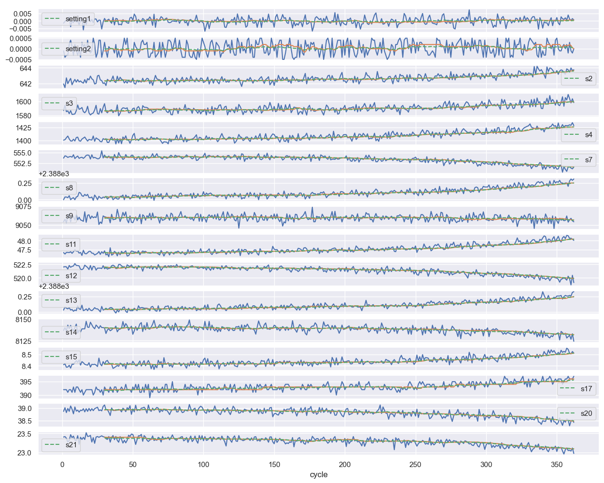
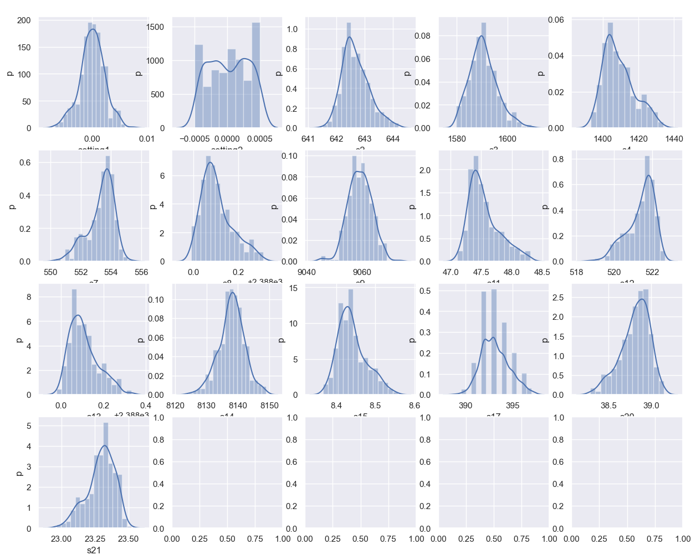
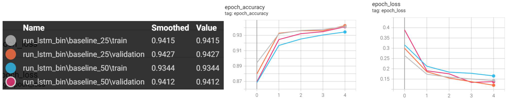

### 1. Predictive Maintenance
  Predictive maintenance involves developing models that accurately determine the condition of in-service equipment (typically industrial machinery), thereby determining when the equipment might encounter failures and/or when maintenance must be performed on them. This approach achieves significant cost savings as maintenance tasks are performed only when warranted as opposed to planned periodic maintenance.

### 2. Goal
* predict whether or not an industrial machine is going to fail

* predict the point of time at which the machine will fail by predicting its “Remaining Useful Lifetime” (RUL). 

### 3. Data Description
  The data set is derived from running turbofan engines. The data set is divided into a training set and a test set. The dataset contains 21 sensor readings which form the multi-variate time series data and 100 different machines’ data are recorded. Each machine initially has some wear, and there are manufacturing variations, but this is considered normal. There are three operational settings that affect engine performance. Data is also contaminated by sensor noise. 

  At the beginning, the engine starts at normal state, and a fault occurs at some later point. In the training set, the fault grows until a system failure occurs. Hence, each observation in the training set is an operation cycle and each machine’s total run to failure data is captured. In the test set, the time series ends before a system failure occurs. Thus, the problem statement is to predict the number of remaining operational cycles before a system failure occurs (also called the “Remaining Useful Lifetime” (RUL)) at the end of each sequence in the test set.

### 4. Related Pictures
1. Data Exploration;
2. Data Exploration;
3. Training.

 

